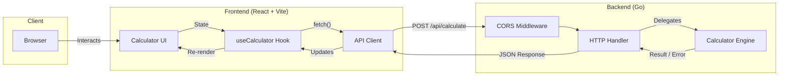
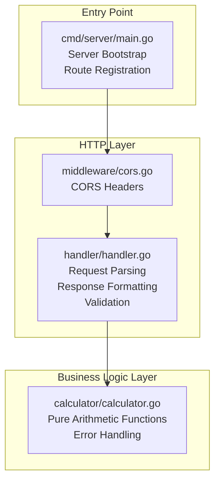
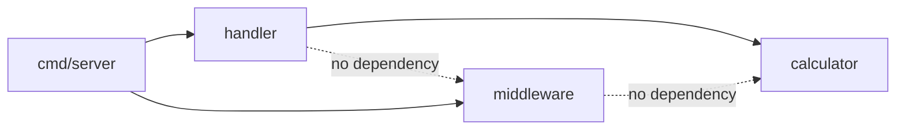
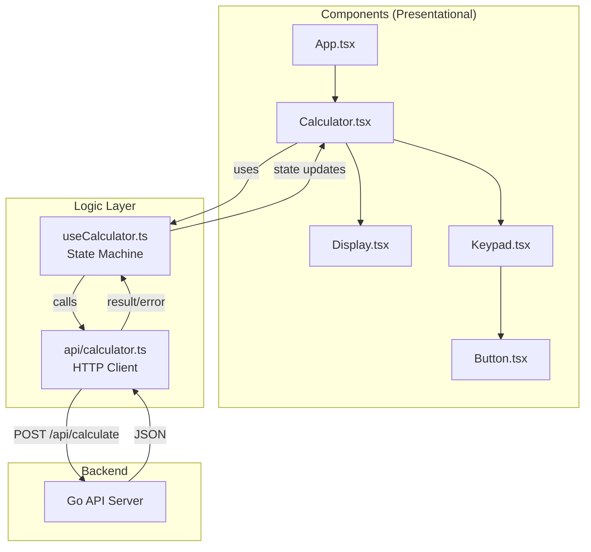
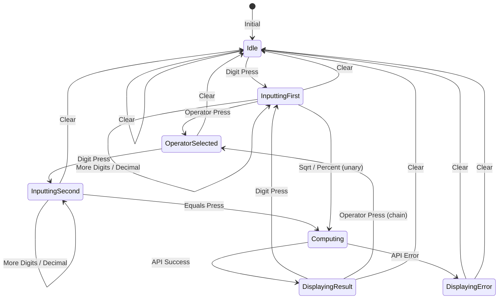
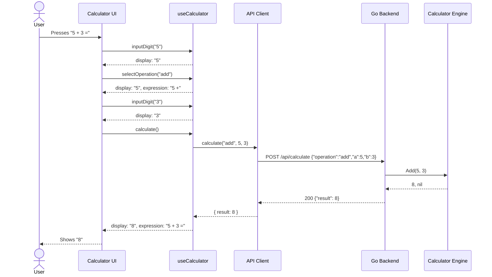
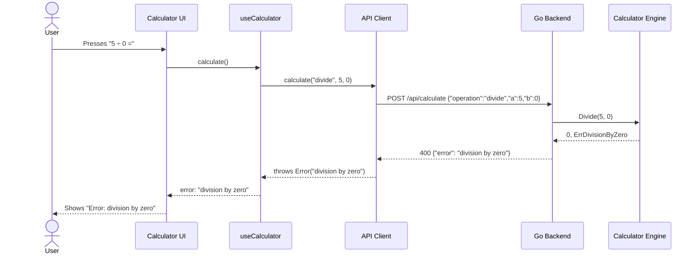
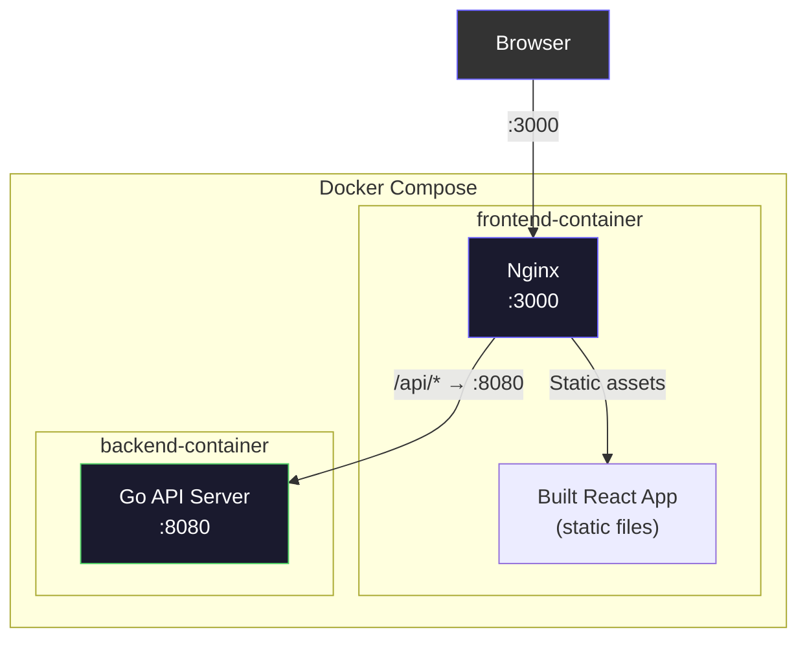

# Architecture

## System Overview

The Fullstack Calculator is a two-tier web application following a **client-server architecture**. The React frontend acts as a thin presentation layer that delegates all computation to the Go backend via REST API calls.

---

## Backend Architecture

The backend follows a **layered architecture** with strict separation of concerns. Each layer has a single responsibility and communicates only with adjacent layers.

### Package Dependency Rules

- `calculator` has **zero imports** from other project packages — it is pure and self-contained
- `handler` imports `calculator` only — it never touches middleware
- `main` wires everything together

---

## Frontend Architecture

The frontend uses **unidirectional data flow** with a custom hook managing all state transitions.

### State Machine

---

## Request / Response Flow

### Error Flow

---

## Deployment Architecture

---

## Technology Decisions

| Decision | Choice | Rationale |
|----------|--------|-----------|
| Go HTTP framework | Standard library `net/http` | No external dependencies, sufficient for a REST API of this size |
| Frontend framework | React + TypeScript | Strong typing, component model, extensive ecosystem |
| Build tool | Vite | Fast HMR, native TypeScript support, simple proxy config |
| CSS approach | Vanilla CSS + custom properties | Full control, no build-time overhead, design tokens via variables |
| State management | Custom hook | No need for Redux/Zustand — state is localized to one component tree |
| API design | Single unified endpoint | Simpler contract, easier to validate, one handler function |
| Testing (Go) | Standard `testing` + `httptest` | No external test framework needed |
| Testing (React) | Vitest + Testing Library | Fast, Vite-native, encourages testing behavior over implementation |
| Deployment | Docker Compose | Simple multi-container orchestration, reproducible environments |
